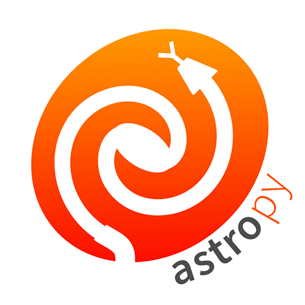
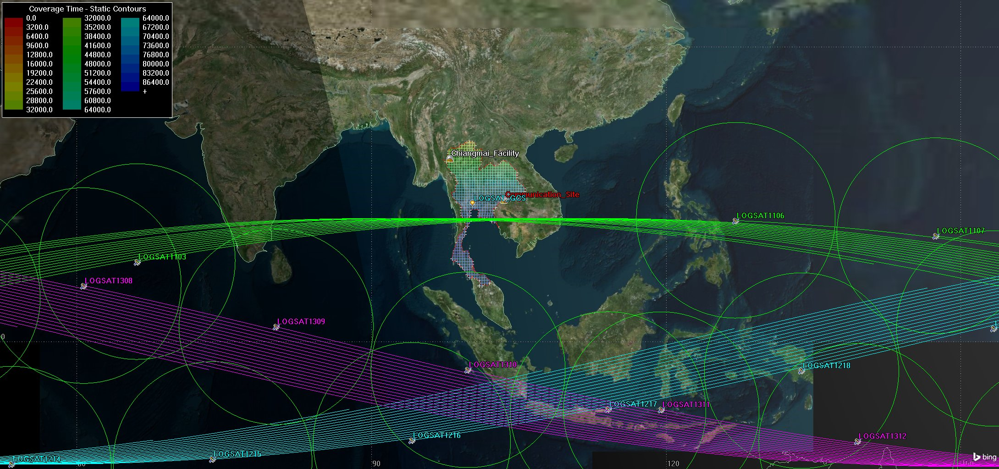

# Satellite Visibility Simulation 🚀

Simulating satellite visibility from **Chiang Mai, Thailand (18.852706° N, 98.958425° E, 351 m)** with both **synthetic Walker-Delta constellation modeling** and **real TLE-based orbit propagation**. This project includes comprehensive mission analysis tools for CubeSat communication systems and STK scenarios for detailed constellation coverage analysis.

✨ This project connects orbital mechanics with ground station visibility analysis, providing a foundation for constellation design, satellite tracking studies, and mission analysis.

## Technology Stack

<div align="center">
  
  
  
</div>

**Core Technologies:**
- **Python** - Data analysis and constellation simulation
- **Astropy** - Orbital mechanics, time systems, and coordinate transformations
- **ANSYS STK** - Advanced mission analysis and visualization

**Key Capabilities:**
- **Orbital Mechanics**: SGP4 propagation, coordinate transformations (ECI↔ECEF↔LLH)
- **Time Systems**: UTC, local time (UTC+7), sidereal time calculations
- **Coverage Analysis**: Elevation angle tracking, gap analysis, continuity assessment
- **Mission Planning**: Walker-Delta constellation optimization for Thailand coverage

## Overview
- [Walker-Delta Simulation](#walker-delta-simulation)
- [TLE Propagation](#tle-propagation)
- [STK Mission Analysis](#stk-mission-analysis)
- [Requirements](#requirements)

## Walker-Delta Simulation
**Files:** `walker_delta_draft_positive_visible.py`

Implements configurable **Walker-Delta constellation** generators with coverage analysis. The main analysis tool provides mission planning capabilities for Thailand coverage requirements.
<!-- **Files:** `walker_delta_draft_positive_visible.py`, `walker_delta_NPF_15_5_1.py`

Implements configurable **Walker-Delta constellation** generators with coverage analysis. The main analysis tool (`walker_delta_NPF_15_5_1.py`) provides automated constellation optimization, coverage continuity analysis, and mission planning capabilities for Thailand coverage requirements. -->

**Key Features:**
- Configurable constellation parameters (N, P, F, inclination, altitude)
- Coverage gap analysis and continuity assessment
- Elevation angle tracking with 10° minimum threshold
- Automated optimization for continuous coverage

## TLE Propagation
**File:** `TLE_All_Visible.py`

Uses real **Two-Line Elements (TLEs)** and propagates satellite motion with the **SGP4 model** for accurate orbital mechanics analysis.

## STK Mission Analysis
**Directory:** `STK-11-Scenarios/`

Complete STK workspace containing 54-satellite Walker-Delta constellation analysis optimized for Thailand coverage. The scenario includes three orbital planes with 18 satellites each, configured at 12.5° inclination and 1000 km altitude for optimal coverage of the 5° to 20° latitude region.

**Constellation Configuration:**
- 54 LOGSAT satellites in Walker-Delta formation
- 3 orbital planes with RAAN and argument of periapsis shifts
- Simple conic coverage with 45° half-angle
- Ground stations: Chiang Mai Facility and Communication Site

**Communication Analysis:**
- Ka-band downlink for high data rate transmission
- S-band downlink for command and control
- Link budget analysis with adequate margins
- Coverage continuity >99% with <5 minute maximum gaps



*2D visualization of the 54-satellite Walker-Delta constellation showing orbital planes and coverage patterns over Thailand*

**Advanced Subsystem Integration:**
The STK scenarios consider communication subsystem requirements, thermal control analysis, electrical power system (EPS) modeling, and payload accommodation for mission-specific requirements.

## Requirements
Install dependencies with:
```bash
pip install numpy pandas astropy sgp4 matplotlib
```

## How to Run

**Python Analysis:**
```bash
# Run constellation analysis
python walker_delta_draft_positive_visible.py

# TLE-based analysis
python TLE_All_Visible.py
```

**STK Analysis:**
1. Open STK 11
2. Load workspace: `STK-11-Scenarios/...`
3. Run coverage and link budget analyses
4. Generate reports and visualizations

## Analysis Results

**Coverage Performance:** >99% coverage with <5 minute maximum gaps, elevation angles 10° to 90°, up to 3-4 satellites simultaneously visible.

**Communication Performance:** Adequate link budget margins for Ka-band and S-band, high-throughput downlink capabilities, reliable command and control uplink.

---

<!-- *This project is part of the EOS Orbit Internship 2026 mission analysis initiative.* -->
<!-- # python walker_delta_NPF_15_5_1.py
python walker_delta_draft_positive_visible.py

# # Plot coverage from existing data
# python plot_coverage_from_csv.py walker_delta_N20_P5_F1_i12_h600km_2024-10-21_analysis.csv -->